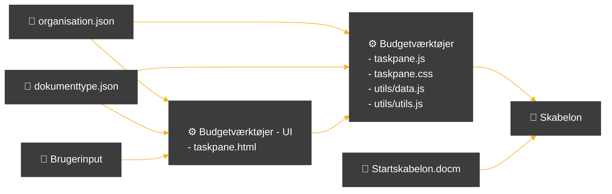
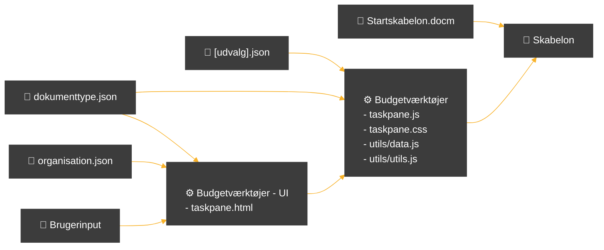
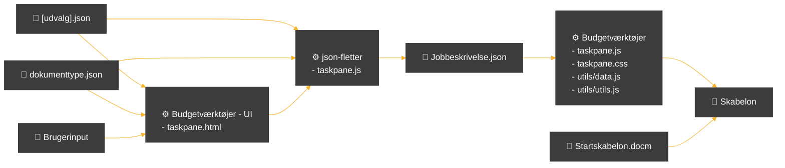

# Budgetværktøjer (budget-word-app)
## Før


## Nu

## To be



https://learn.microsoft.com/en-us/javascript/api/word/word.documentproperties?view=word-js-preview#word-word-documentproperties-comments-member


```
[
    {
        "udvalg":"<Navn på udvalg>",
        "forkortelse":"<Forkortelse på udvalg>",
        "bevillingsområde":[
            {
                "navn"="<Navn på bevillingsområde #1>"
                "delomårde":[
                    "<span style="color:blue"><delområde #1></span>", 
                    "<delområde #2>",
                    "<delområde #3>",
                    ...
                ],                    
                "indkomstoverførsler":[],
                "ældreboliger":[],
                "brugerfinansieret":[],
                "centralerefusionsordninger":[]


            },
            {
                ...
            }
        ],
        "dokumenter":[
            {
                "navn":"Budgetopfølgning",
                "sektioner":[[]],
                "undersektioner":[
                    {
                        "bevilling":[[],[]],
                        "anlæg":[[]],
                        "bevillingsansøgninger":[[],[]]
                    }
                ],
                "customTabeller":[
                    {  
                        "navn":"ct1",
                        "placering":"Bevilling Administration Servicerammen Social og Arbejdsmarked",
                        "tabelnr":<nr>,
                        "kolonner":[
                            "<Kolonne #1>","<Kolonne #2>",...
                        ],
                        "rækker":[
                            "<Række #1>","<Række #2>",...
                        ]
                    }
                ]
            }
        ]

    }
]
```


## Office Javascript API (WordApi 1.5)


## VBA 


* [word.table.descr](https://learn.microsoft.com/en-us/office/vba/api/word.table.descr)
* [word.table.title](https://learn.microsoft.com/en-us/office/vba/api/word.table.title)